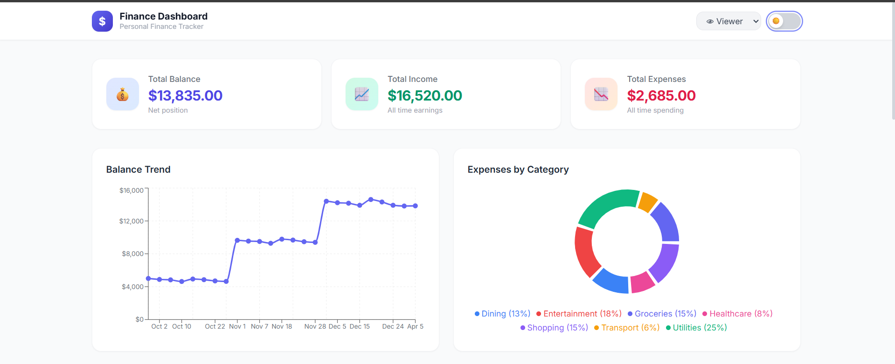
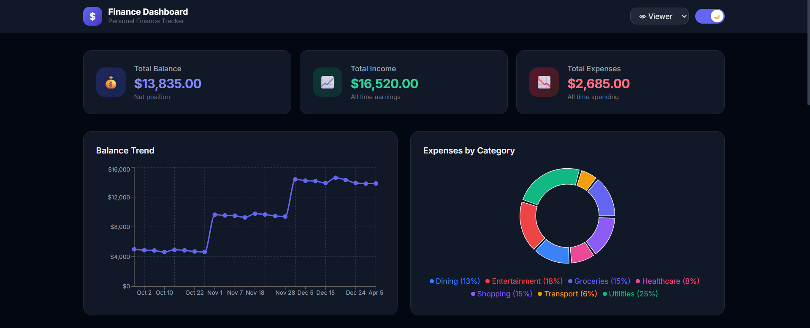

# 📊 Finance Dashboard UI

A modern, responsive, and interactive frontend finance dashboard application designed to help users seamlessly track their income, expenses, and financial insights.

---

## 🚀 Live Demo

**Check out the live application here:**  
[https://finance-dashoboard-ui.vercel.app/](https://finance-dashoboard-ui.vercel.app/)

**GitHub Repository:**  
[https://github.com/abhiraj2512/finance-dashoboard-ui](https://github.com/abhiraj2512/finance-dashoboard-ui)

---

## ✨ Features

- **Dashboard Overview:** Instantly view your total balance, total income, and total expenses via clean summary cards.
- **Line Chart (Balance Trend):** Visualize how your balance changes over time with interactive tooltips.
- **Pie Chart (Expense Breakdown):** Easily see the distribution of your spending across various categories.
- **Transaction Table:** A comprehensive view of all your transactions.
- **Filtering, Sorting, and Search:** Effortlessly find specific transactions by searching category, filtering by type, or sorting by date and amount.
- **Role-based UI (Viewer/Admin):**
  - *Viewer:* Can read and track all financial data.
  - *Admin:* Can simulate adding new transactions via a dynamic modal.
- **Insights Section:** Intelligent snapshots of your monthly comparisons, highest spending category, and overall savings rate.
- **Responsive Design & Dark Mode:** Carefully crafted to operate flawlessly on mobile, tablet, and desktop—paired with an integrated dark/light mode toggle.

---

## 🛠 Tech Stack

- **React** (UI Components & Rendering)
- **TypeScript** (Static Typing & Scalability)
- **Tailwind CSS** (Utility-first Styling & Dark Mode)
- **Recharts** (Declarative Data Visualization)
- **Context API** (Global State Management)

---

## 📁 Folder Structure (Brief Overview)

```text
src/
├── components/
│   ├── charts/        # Line and Pie chart components (Recharts)
│   ├── dashboard/     # Summary cards and Add Transaction modal
│   ├── insights/      # Automated insights logic and rendering
│   ├── layout/        # Shared structure including Header and Navigation
│   └── transactions/  # Searchable & sortable data table
├── context/           # React Context for global state (FinanceContext)
├── data/              # Mock transaction data payload
├── hooks/             # Custom React hooks (e.g., useFinance)
├── pages/             # Main view assembly (DashboardPage)
├── types/             # TypeScript definitions and interfaces
└── utils/             # Helper functions (calculations, formatters, themes)
```

---

## ⚙️ Setup Instructions

To run this project locally, follow these steps:

1. **Clone the repository:**
   ```bash
   git clone https://github.com/abhiraj2512/finance-dashoboard-ui.git
   cd finance-dashoboard-ui
   ```

2. **Install dependencies:**
   ```bash
   npm install
   ```

3. **Run the development server:**
   ```bash
   npm run dev
   ```

4. **Open in browser:**
   Open [http://localhost:5173/](http://localhost:5173/) to view the application.

---

## 📸 Screenshots


*(Note: Replace placeholder with actual screenshot path)*


*(Note: Replace placeholder with actual screenshot path)*

---

## 🔮 Future Improvements

- **API Integration:** Connect the frontend to a real backend database (e.g., Node.js / NestJS) for persistent data storage.
- **Authentication:** Implement true login mechanics using JWT and Auth providers instead of a simulated UI dropdown.
- **Advanced Analytics:** Add yearly breakdowns, custom date range filtering, and dynamic budgeting goals.
- **Export Functionality:** Allow users to download transaction history as CSV or PDF files.

---

## 📝 Additional Note

This project was built as part of a frontend assessment emphasizing modern UI/UX design, modular component architecture, structured state management, and elegant data visualization using React and standard enterprise patterns.
